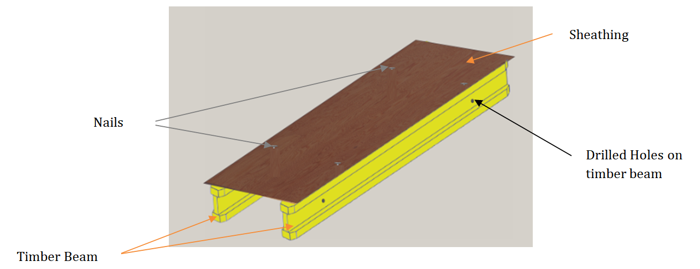
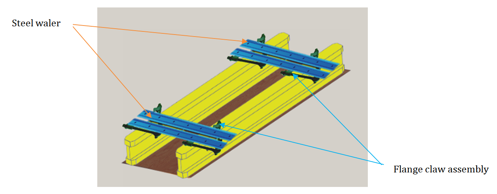
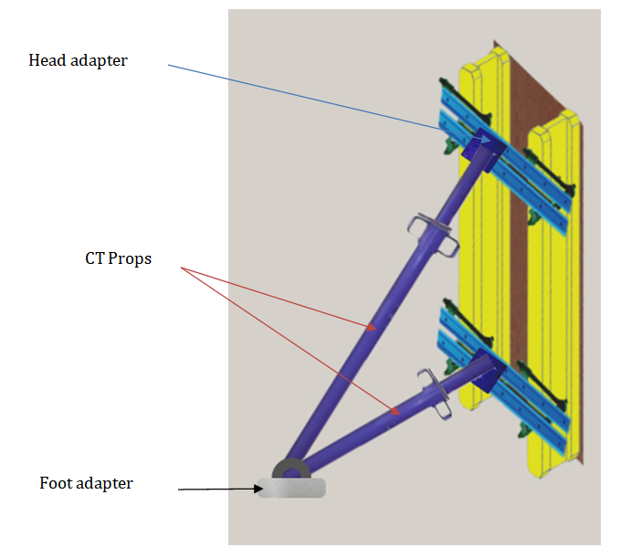
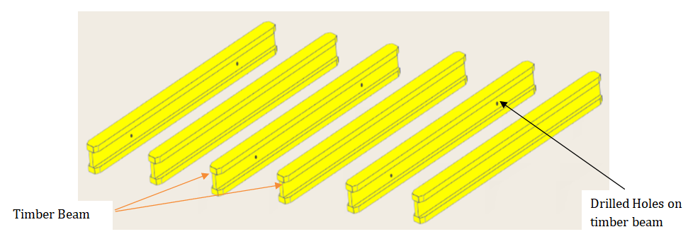
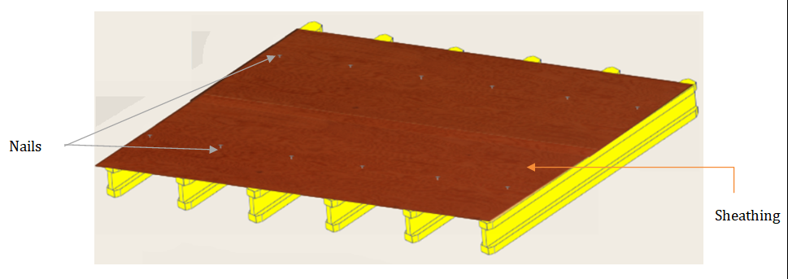
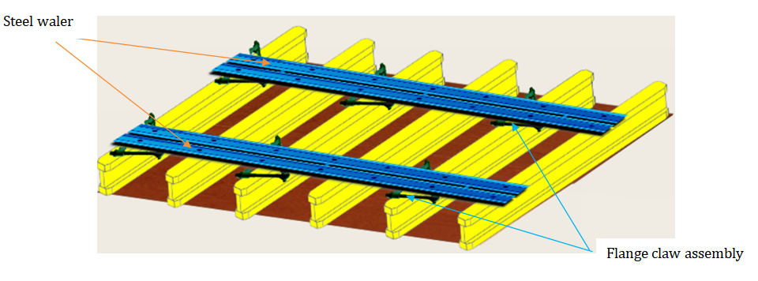
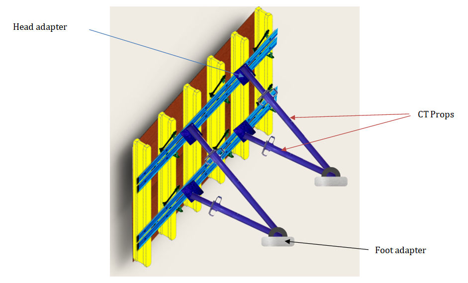
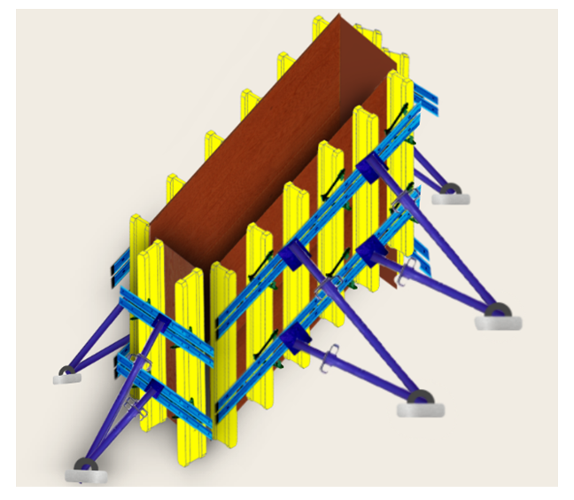

### Procedure

#### 1. Marking the Area (rectangularly): 
-	Mark the dimensions of the column area (e.g., 2400 x 300). 

  

	
#### 2. Setting Up the Formwork: 
-	Bring timber beam at the site and drill holes on it. 

#### 3. Place plywood sheathing on timber beam with the help of nailing. 

  

	
#### 4. Attaching Supports: 
-	Join the steel waler with timber beam using flange claw assembly. 

  

	
#### 5.	Providing Vertical Support: 
-	Lift the one side of column and attach CT prop to Steel waler with the help of Head adapter and Foot adapter. 

  

	
#### 6.	Completing the Formwork: 
- Bring timber beam and drill holes on it to make other side. 

  

	
#### 7.	Plywood sheathing on timber beam with the help of nailing. 

  

	
#### 8.	Join the steel waler with timber beam using flange claw assembly. 

  

	
#### 9.	Lift the one side of wall and attach CT prop. 

  

	
#### 10.	Repeat step 2 to 9 to build remaining three sides of wall. 

  

	
Now, Formwork is ready for further concreting purposes. 

