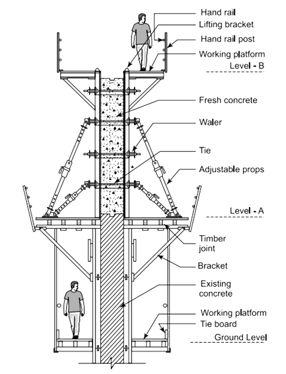
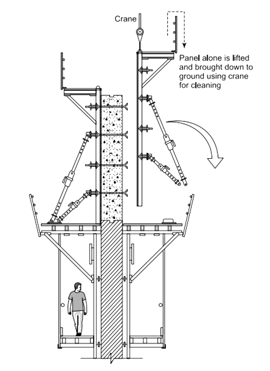
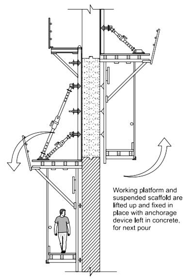

### Theory

 
Formwork for a wall is a temporary mold used to shape and support the wet concrete until it hardens and gains sufficient strength. The process involves several steps to ensure the wall is properly constructed with the correct dimensions and alignment. The components include Timber beam, Plywood, Flange claw assembly, Steel waler, Tie Rod, Wing nut, Anchor plate, CT Prop, Head adapter, Foot adapter and among others.

#### 1.	Components of Wall Formwork: 
-	<b>Timber beam:</b> used to transfer load from sheathing to steel waler. 
-	<b>Plywood:</b> used for sheathing directly contact with concrete surfaces. 
-	<b>Flange claw assembly:</b> For connecting and holding Steel walers with Timber beams. 
-	<b>Tie Rod:</b> transmitting the load from the steel waler to itself. 
-	<b>Wing nut:</b> used for tightening and loosing of Tie Rod. 
-	<b>Anchor plate:</b> Anchor plates consist of a steel plate with welded-on shear bolts and are used to attach steel components to concrete elements. For this purpose, the anchor plates are concreted into the concrete element. The shear bolts serve as anchoring. 
-	<b>Steel Waler:</b> Steel beams that provide structural support to the formwork. 
-	<b>CT Prop (Double Nut):</b> Adjustable props that provide vertical support to the formwork. 
-	<b>Head Adapter and Foot Adapter:</b> Connectors that secure the CT props to the formwork and the ground. 

 

#### 2. Procedure: 
Here's a general overview of the steps involved in setting up formwork for a wall: 

##### 1. Design and Planning: 
-	<b>Determine Wall Dimensions:</b> Based on the construction drawings, determine the height, thickness, and length of the wall. 
-	<b>Choose Materials:</b> The most common materials for wall formwork include timber, plywood, steel, or aluminum. Steel and aluminum are preferred for repeated use, while timber and plywood are more common for smaller projects. 

##### 2. Preparation of the Formwork: 
-	<b>Cut the Panels:</b> Cut the plywood or timber to the required dimensions to form the sides of the wall. 
-	<b>Assemble the Panels:</b> The formwork panels are assembled to create two parallel vertical sides (faces) of the wall. These panels are held together by horizontal and vertical supports (wales and studs) to maintain their shape. 
-	<b>Install Ties:</b> Form ties are placed between the two sides of the formwork to maintain the correct wall thickness and to resist the pressure of the wet concrete. Ties are crucial to prevent the formwork from bulging. 

##### 3. Erection of the Formwork: 
-	<b>Position the Formwork:</b> Set the formwork in the desired location where the wall is to be constructed. The formwork should be aligned properly to ensure the wall is straight and level. 
-	<b>Bracing and Supports:</b> Use bracing, such as diagonal props or kickers, to stabilize the formwork. This prevents movement or deformation during the concrete pour. 
-	<b>Apply Release Agent:</b> To prevent the concrete from sticking to the formwork, apply a release agent (usually oil or a commercial product) on the inner surface of the formwork. 

##### 4. Reinforcement:  
-	<b>Install Reinforcement Bars:</b> Place and tie the reinforcement bars (rebar) inside the formwork as per the structural design. The rebar is essential for the strength of the wall and should be positioned correctly within the formwork. 
-	<b>Position Spacers:</b> Use spacers to ensure that the reinforcement bars are properly positioned within the concrete, maintaining the required cover to protect the steel from corrosion. 

##### 5. Pouring Concrete: 
-	<b>Concrete Mix:</b> Prepare the concrete mix according to the required specifications. 
-	<b>Pour the Concrete:</b> Pour the concrete into the formwork in layers. It is important to pour evenly to avoid creating voids or honeycombing. Vibrators are used to remove air pockets and ensure the concrete flows around the reinforcement. 
-	<b>Curing:</b> After pouring, allow the concrete to cure properly to achieve the desired strength. Proper curing prevents cracks and ensures the durability of the wall. 

##### 6. Removal of Formwork: 
-	<b>Curing Time:</b> Wait for the concrete to gain adequate strength before removing the formwork. The time required depends on factors like temperature, humidity, and concrete mix. 
-	<b>Dismantle the Formwork:</b> Carefully remove the bracing, ties, and then the formwork panels, starting from the top to avoid damaging the wall. 
-	<b>Surface Finishing:</b> Once the formwork is removed, address any surface imperfections and finish the wall as required. 

##### 7. Safety Considerations: 
-	Follow safety protocols when erecting, pouring, and dismantling the formwork. 
-	Ensure that the formwork is stable and securely braced throughout the process. 

 

Formwork for walls is crucial in ensuring that the column is constructed with the correct shape, size, and alignment. Proper planning and execution are essential to avoid defects in the finished concrete structure.
  
Formwork must meet several requirements to ensure the quality, safety, and economy of the concrete structure. The formwork should be strong enough to bear the load of the concrete and any construction activities, be accurately constructed to ensure the correct shape and dimensions of the concrete structure, and be reusable to minimize costs.

##### Additional Notes: 
Formwork Systems: There are various formwork systems available, such as traditional timber formwork, modular formwork, or proprietary systems like jump form or slip form, depending on the project’s needs.

Climbing formwork, also known as jump form or self-climbing formwork, is a system used in the construction of tall vertical structures such as high-rise buildings, towers, bridge pylons, and other large concrete structures. This formwork system "climbs" up the structure as the construction progresses, allowing for the continuous casting of concrete without the need to dismantle and reassemble the formwork at each level.

#### Types of Climbing Formwork: 

##### 1. Regular Climbing Formwork: 
-	This type relies on cranes or other lifting devices to move the formwork to the next level after the concrete has set. 
-	The formwork is repositioned at regular intervals as the structure rises, hence the term "jump form". 

##### 2. Self-Climbing Formwork: 
-	Self-climbing formwork uses hydraulic jacks or mechanical systems to lift the entire formwork setup, including working platforms, without the need for a crane. 
-	It is ideal for high-rise structures where crane time is limited and where vertical structures require uninterrupted construction. 

##### Components of Climbing Formwork 

-	<b>Formwork Panels:</b> These are the vertical or horizontal panels that shape the concrete. 
-	<b>Working Platforms:</b> Multiple levels of platforms are provided for workers to perform tasks such as setting up reinforcement, pouring concrete, and controlling the formwork. 
-	<b>Climbing Rails/Tracks:</b> These guide the formwork as it climbs up the structure. In self-climbing systems, these rails are often attached directly to the structure. 
-	<b>Hydraulic or Mechanical Jacks:</b> In self-climbing systems, these are used to raise the formwork to the next level without needing cranes. 
-	<b>Anchors and Ties:</b> These are fixed to the hardened concrete and hold the formwork in place during the pouring process. The climbing mechanism typically attaches to these anchors. 

##### Advantages of Climbing Formwork 

-	<b>Efficiency:</b> Since the formwork can be moved upwards without being dismantled, construction progresses faster. 
-	<b>Safety:</b> The system often includes enclosed working platforms, improving safety for workers at height. 
-	<b>Precision:</b> The formwork is aligned perfectly at each level, ensuring high precision and quality of the vertical structure. 
-	<b>Cost-Effective for High-Rises:</b> Although more expensive initially, climbing formwork reduces labor and time, making it cost-effective for tall structures. 

##### Process of Using Climbing Formwork 

###### 1. Initial Setup: 
-	The climbing formwork is initially positioned and anchored to the foundation or the base level of the structure. 
-	Formwork panels and working platforms are set up for the first concrete pour. 

###### 2. Concrete Pouring: 
-	Concrete is poured into the formwork and allowed to cure. Reinforcement bars are placed as per design. 
-	The formwork provides support and shape to the concrete while it sets. 

###### 3. Climbing: 
-	After the concrete has gained sufficient strength, the formwork is detached from the previous level. 
-	Using hydraulic jacks (in self-climbing systems) or cranes (in regular systems), the formwork is lifted to the next level, where it is secured in place. 

###### 4. Repeat Process: 
- The process is repeated for each level, with the formwork "climbing" the structure as construction progresses upward. 

###### 5. Final Removal: 
- Once the structure is completed, the formwork is dismantled and removed. 

##### Applications of Climbing Formwork 

-	<b>High-Rise Buildings:</b> Climbing formwork is ideal for continuous vertical elements such as core walls, lift shafts, and stairwells. 
-	<b>Bridge Pylons:</b> Used in the construction of tall bridge towers or pylons where large vertical elements are required. 
-	<b>Towers and Chimneys:</b> Suitable for structures like industrial chimneys, cooling towers, and other similar structures. 

Climbing formwork systems are essential for modern high-rise construction, providing efficiency, safety, and precision. These systems are particularly advantageous for projects where speed and accuracy are critical, and where conventional formwork methods would be too time-consuming or labor-intensive.
<table border="0" align="center" style="width:100%; border:none;">
  <tr>
<td style="width:50%">

  
Figure 5.4 (a) Climbing Formwork Arrangement for Second Pour.
  

</td>
<td style="width:50%">
  

  
Figure 5.4(b) Stripping of Wall Formwork.
  

 
    </td>
  </tr>
  <tr>
<td colspan="2" style="width:50%; text-align:center">

  
Figure 5.4(c) Fixing of Suspended Scaffold to Receive the Wall Formwork for Third Lift.
  

 
    </td>
  </tr>
</table>
